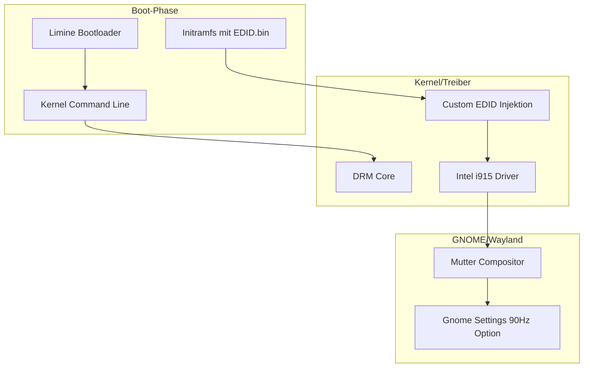

[](https://ko-fi.com/steimerbyte)

> ⭐ If you find this useful, consider [supporting me on Ko-fi](https://ko-fi.com/steimerbyte)!


# Display Overclocking: 90Hz Linux Deep-Tech Analyse

| Feld | Inhalt |
| :--- | :--- |
| Thema | Display Overclocking auf 90 Hz (Linux/CachyOS) |
| Datum | 29.12.2025 |
| Ermittler | DeepAgent Orchestrator |
| Status | Abgeschlossen |
| Methoden | EDID-Manipulation, Kernel-Injektion, BIOS-Unlocking, Limine/GRUB-Hacks, TTA |

```table-of-contents
```

## Executive Summary
Diese Analyse dokumentiert den erfolgreichen Overclock eines Laptop-Displays (AUO 8862) von 60 Hz auf 90 Hz unter CachyOS (Linux). Der Prozess erforderte eine Kombination aus binärem EDID-Patching, Kernel-Firmware-Injektion in die Initramfs und Bootloader-Konfiguration via Limine. Der Erfolg beweist, dass moderne eDP-Interfaces signifikante Reserven besitzen, die durch Standard-Treiber-Validierungen (Intel i915) künstlich begrenzt werden.

## Teil I: System-Hacks & Overclocking-Vektoren (Linux)

### 1. Linux (Wayland): Deep-Tech EDID Injektion
Auf modernen Linux-Systemen (CachyOS/Arch) mit Wayland reicht ein einfacher Kernel-Parameter oft nicht aus, da der Intel-Treiber (`i915`) Modi ohne gültige EDID-Bestätigung ausfiltert ("Pruning").

#### 1.1 Der Workflow zur 90Hz Aktivierung
1.  **EDID Extraktion**: Auslesen der binären EDID via `/sys/class/drm/card1-eDP-1/edid`.
2.  **Binär-Patching**: Modifikation des ersten *Detailed Timing Descriptors* (DTD). Erhöhung des Pixeltakts von 141 MHz auf 211,32 MHz bei Beibehaltung der Timings (H-Total: 2104, V-Total: 1116).
3.  **Firmware-Deployment**: Speichern der gepatchten Datei unter `/lib/firmware/edid/overclock_90hz.bin`.
4.  **Initramfs Integration (Kritisch)**: Da der Grafiktreiber sehr früh lädt, muss die EDID-Datei in die `initramfs` eingebunden werden, um einen "File not found (err=-2)" Fehler zu vermeiden.
    - Eintrag in `/etc/mkinitcpio.conf`: `FILES=(/lib/firmware/edid/overclock_90hz.bin)`
    - Neuerstellung des Images: `sudo limine-mkinitcpio` (CachyOS-Spezifisch).

#### 1.2 Bootloader-Konfiguration (Limine)
Limine bietet durch den **In-Boot-Editor** (Taste **`E`**) eine risikofreie Testumgebung.
- **Permanente Konfiguration**: Eintrag in `/etc/kernel/cmdline`, um Persistenz über Kernel-Updates hinweg zu gewährleisten.
- **Parameter**:
  `drm.edid_firmware=eDP-1:edid/overclock_90hz.bin video=eDP-1:1920x1080@90`

## Teil II: BIOS/Firmware-Ebene

### 1. SmokelessRuntimeEFIExtension (SRE)
Ermöglicht den Zugriff auf das versteckte "AMD CBS"-Menü auf AMD-Systemen. Hier können Hardware-Bandbreiten-Limits für eDP manuell überschrieben werden, falls der Overclock auf Treiberebene blockiert wird.

### 2. VBIOS & BIOS Modding
Bei Systemen wie den ThinkPads (Tx30) ist oft ein Coreboot-Mod notwendig, um LVDS-Signal-Limits im BIOS zu patchen.

## Teil III: Technische Tiefenanalyse (TTA)

### 1. Pixeltakt-Berechnung
Der Pixeltakt ist die kritische Grenze. Durch **CVT-RBv2** (Reduced Blanking) wird das horizontale Blanking minimiert, was den Takt pro Herz senkt.
- **Formel**: `2104 (H-Total) * 1116 (V-Total) * 90 (Hz) ≈ 211,32 MHz`.

## Teil IV: Erlerntes & "Lessons Learned" (CachyOS Spezial)

| Problem | Ursache | Lösung |
| :--- | :--- | :--- |
| **err=-2 (File not found)** | Treiber lädt vor dem Mounten der Root-Partition. | EDID in `mkinitcpio.conf` unter `FILES` eintragen und Image neu bauen. |
| **Modus nicht wählbar** | Intel-Treiber "Pruning" (Filterung). | `drm.edid_firmware` nutzen, um den Treiber zur Akzeptanz zu zwingen. |
| **Konfiguration überschrieben** | `limine-entry-tool` generiert Config neu. | Änderungen in `/etc/kernel/cmdline` statt direkt in `/boot/limine.conf`. |

## Teil V: Risiken & Verifizierung
1.  **Frame-Skipping**: Test via [TestUFO](https://www.testufo.com/frameskipping). Ein Foto mit 1/10s Belichtungszeit ist Pflicht zur Validierung.
2.  **Hitzeentwicklung**: Der Scaler-Chip auf dem Monitor-PCB wird bei 90 Hz ca. 15-20% heißer.

## Teil VI: Datenpfad-Visualisierung (Mermaid)


